# *Embodied System - Sensing the digital*

Katharina Kleinhans · First Term Project WiSe 25/26 · Filmuniversität KONRAD WOLF Babelsberg

---

# Project Documentation

## Table of Contents

1. [Concept and Early Exploration](#1-concept-and-early-exploration)
   - 1.1 [Concept Development](#11-concept-development)
   - 1.2 [First Technical Setup – Hardware and Software Decisions](#12-first-technical-setup--hardware-and-software-decisions)
   - 1.3 [First Sound Experiments](#13-first-sound-experiments)

2. [Testing and Technical Reorientation](#2-testing-and-technical-reorientation)
   - 2.1 [First User Test – 04.02. with the Acting Class](#21-first-user-test--0402-with-the-acting-class)
   - 2.2 [Calibration System & Data Normalization](#22-calibration-system--data-normalization)
   - 2.3 [Second Test – 04.03. with Riccardo in the Theater Hall](#23-second-test--0403-with-riccardo-in-the-theater-hall)
   - 2.4 [Data Refinements and Concept Changes](#24-data-refinements-and-concept-changes)
   - 2.5 [Third Test – 06.03. with Riccardo in the Theater Hall](#25-third-test--0603-with-riccardo-in-the-theater-hall)

3. [Final System Development](#3-final-system-development)
   - 3.1 [Dynamic Workflow and Built Pipeline](#31-dynamic-workflow-and-built-pipeline)
   - 3.2 [Sound Design – Reorientation & Reduction](#32-sound-design--reorientation--reduction)
   - 3.3 [Parameter Extensions & Python Scripts](#33-parameter-extensions--python-scripts)
   - 3.4 [MIDI Trigger Connection](#34-midi-trigger-connection-1003)
   - 3.5 [Gesture Detection Setup](#35-gesture-detection-setup)
   - 3.6 [Stillness Detection](#36-stillness-detection-1403)

4. [Key Development Insights](#4-key-development-insights)

---
 

## 1. Concept and Early Exploration

### 1.1 Concept Development

See project plan: [Project Plan](./projectplan_kleinhans.md)

---

### 1.2 First Technical Setup – Hardware and Software Decisions

#### First Motion Data Tracking: PoseNet / Mediapipe

**Goal:** *Enable real-time data communication between TouchDesigner and the digital audio setup.*

For the initial technical setup, I worked with PoseNet, a TouchDesigner component that uses AI to generate skeletal data from camera images. Unlike Kinect V2, which is only compatible with Windows and has to be connected as an external device, PoseNet allowed me to experiment with motion data directly from my laptop camera and independently of the operating system. However, it was never intended to represent the final technical result.

PoseNet mainly helped me to explore the workflow and get a first understanding of how tracked motion data could be processed and later mapped to sound.

[PoseNet GitHub Link](https://github.com/runwayml/touchDesigner/blob/master/PoseNet/TDPoseNet/README.md)

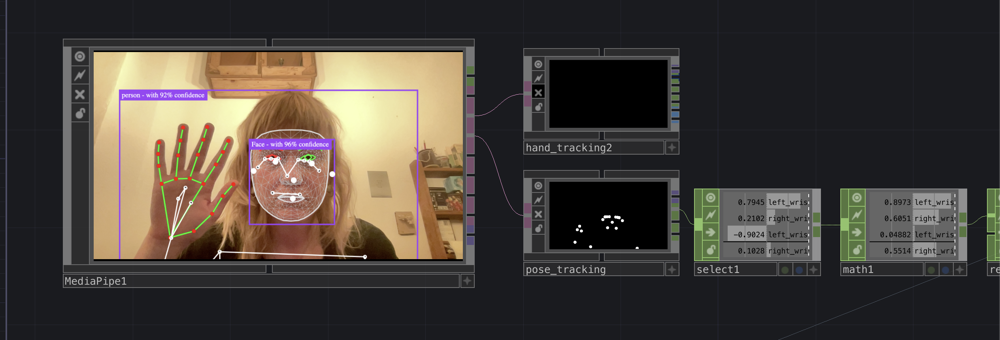

**Steps**
- setting up the PoseNet pipeline
- selecting first parameters
- first experiments with selected data such as joints, speed, and body relations

**Problems**

1. **Limited reliability**
   - PoseNet was useful for early exploration, but not stable enough for a performance context.
   - The tracking quality depended strongly on camera angle and image quality.

2. **CPU overload and OSC clipping**
   - Running TouchDesigner and Ableton on the same laptop caused performance issues.
   - Audio playback became unstable and clipping occurred.

**Learnings**
- PoseNet is a good tool for exploration, but not for the final setup
- I got a first feeling for the relationship between camera perspective and skeleton data
- even early prototypes need to be tested under real-time conditions
- TDPackage: sending values from TouchDesigner to Ableton

---

#### DAC: Max/MSP or Ableton Live?

**Goal:** *Find a tool combination that challenges me, but still allows me to work confidently.*

At the beginning, I considered working with Max/MSP, because it is specifically designed for real-time processes. While researching motion data and sound, I found a tutorial demonstrating how motion data can be sent to Ableton Live in real time using Kinect and then mapped to any given parameter.

Since I had no previous experience with Max/MSP, I decided to work with TouchDesigner and Ableton Live instead.

[Movement Controlled Instruments – TouchDesigner, Ableton Live and Kinect](https://www.youtube.com/watch?v=vHtUXvb6XMM)

The TDAbleton package works through Ableton's MIDI Remote Scripts system and allows two-way communication between TouchDesigner and Ableton via OSC. This was a workflow I was not familiar with at the time.

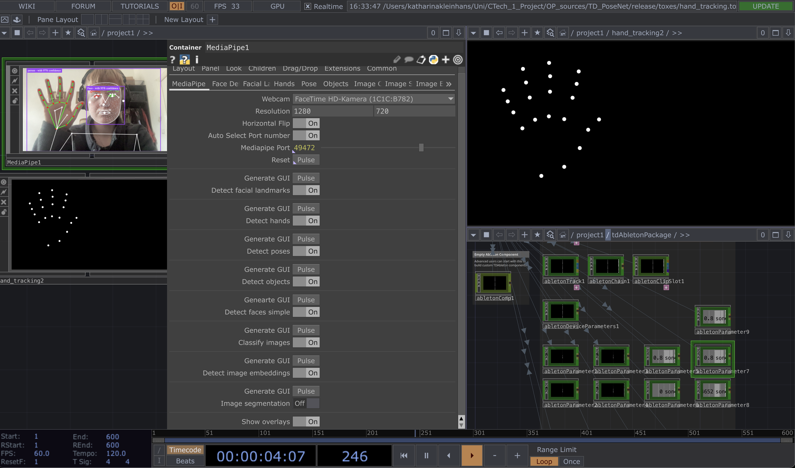

**Steps**
- researching possible audio environments
- comparing Max/MSP and Ableton Live
- deciding on the TouchDesigner + Ableton workflow
- starting to understand TDAbleton and OSC communication

**Problems**

1. **Unfamiliar workflow**
   - I had no previous experience with TDAbleton or Ableton's MIDI Remote Script logic.
   - This made the setup process slower and more trial-and-error based.

2. **Persistent audio clipping**
   - Even after adjusting technical settings, clipping problems continued.
   - The system remained unstable when both programs ran on one machine.

**Attempted solutions**
- increasing the buffer size in Ableton settings
- decreasing the sample rate in Ableton settings
- reducing the frame rate in TouchDesigner
- using Resample CHOPs
- turning on reduced latency when monitoring was off

**Learnings**
- getting familiar with the PoseNet plugin and its values
- understanding the general workflow between TouchDesigner and Ableton
- recognizing early that real-time audio systems are very sensitive to performance issues

---

### 1.3 First Sound Experiments

**Goal:** *Explore Ableton Live and find an audio language that can transport the idea of emotional states.*

A large part of my process involved experimenting with and learning sound production in Ableton Live. Regarding my concept of transferring mental states into sound, I started experimenting without setting strict limits for myself, trying instead to find atmospheres that could express my conceptual idea.

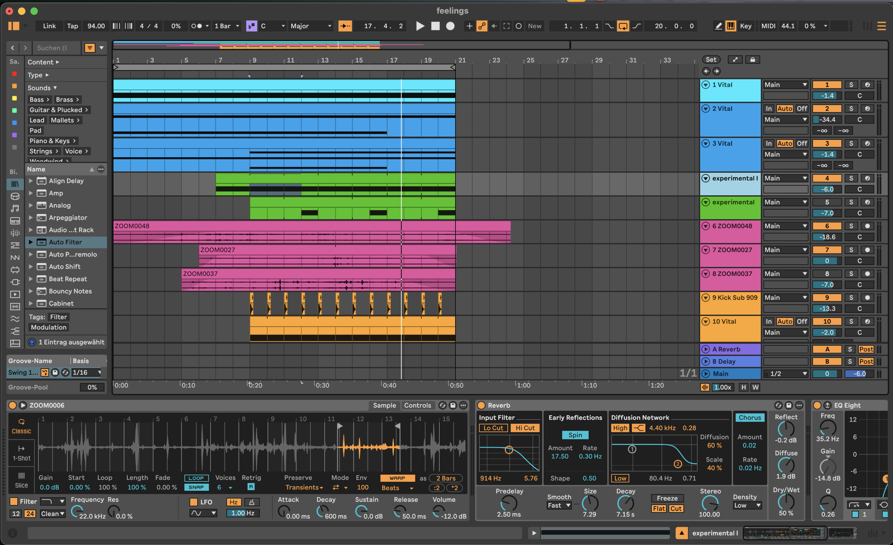

**Steps**
- creating a first audio file that combined multiple layers of synthesizers, recordings, and sample tracks
- testing first parameter mappings
- exploring how movement-related values might affect sound textures

**Problems**

1. **Too many possibilities**
   - I often got lost in sound exploration.
   - It was difficult to decide which sounds were conceptually strong and which were just interesting on their own.

2. **Lack of clarity**
   - Layering too many sounds made the connection between body and sound less readable.
   - The sound became richer, but the interaction became less clear.

3. **Narrative overload**
   - At first, I was still trying to think in terms of linear narration.
   - This distracted me from building a system that worked performatively.

**Learnings**
- further steps in sound production and synthesis
- getting a first feeling for which parameters work for mappings
- clarity is more important than sonic complexity in an interactive system

---

#### Vital Synthesizer

At the beginning, I focused especially on creating low-frequency tracks with the Vital synthesizer plugin. Since my initial idea was that the height of the body should change frequency levels, I wanted to start with simple drone sounds.

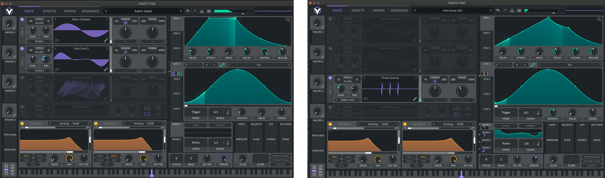

- experiments with Vital in Ableton Live
- concept: low frequencies and vibration as a base element of motion and emotion

**Steps**
- creating different low- and high-frequency oscillating sound tracks
- experimenting with oscillator parameters

**Problems**

1. **Pitch mapping sounded strange**
   - Using pitch as a directly changing parameter often sounded unnatural and distracting.
   - It did not create a convincing embodied relationship.

2. **Too much movement inside the sound itself**
   - Strong oscillator movement could compete with the body–sound relation.
   - The sonic response felt less readable.

**Learnings**
- becoming familiar with the plugin and its oscillator parameters
- configuring instruments in Ableton Live
- understanding that filter changes often work better than direct pitch mapping

 
 

## 2. Testing and Technical Reorientation

### 2.1 First User Test – 04.02. with the Acting Class

As part of the movement project with Prof. Lara Martelli Hisleiter's acting class, I had the opportunity to test the initial technical setup with other CTech students from higher semesters.

**Goal:** *Test the setup with Kinect V2 instead of PoseNet and with basic sound material.*

#### Test File

At this point, I defined three values that I wanted to test:

1. **General body height (`bodyheight`)**
   *Calculation:* selecting the y-position of nose / head / shoulder from the Kinect CHOP

   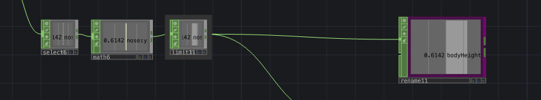

2. **Distance between hands (`distance`)**
   *Calculation:* subtracting the position data of the right hand from the position data of the left hand

   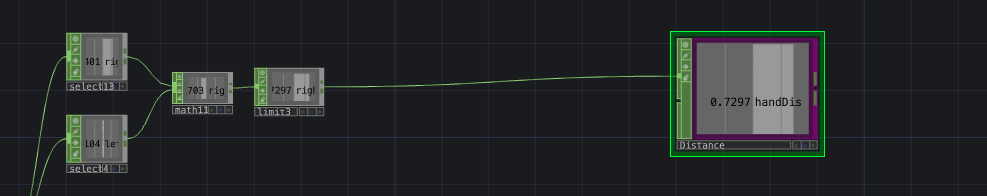

3. **Speed of the body (`speed`)**
   *Calculation:* calculating the average of the x, y, z position values of the shoulders and hips to determine a value for the center of the body. The Slope CHOP can then be used to analyze the speed.

   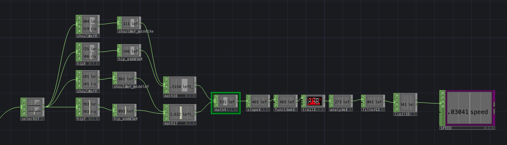

#### Data Visualization

To make the behaviour of the values recognizable and comprehensible, I supplemented the file with a visualization of the data.

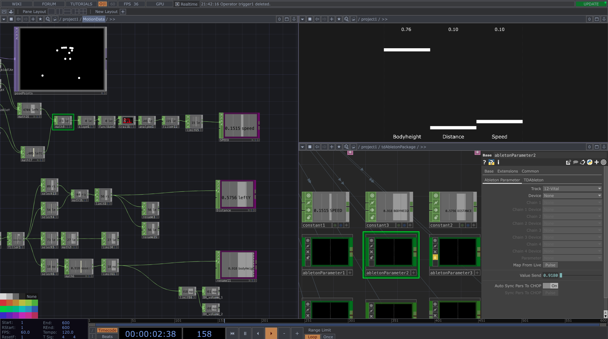

The interface consisted of:
- selecting / calculating motion data from the sensor
- visualizing motion data
- sending the specific values to Ableton

**Steps**
- first technical setup with tracking, data processing, data visualization, and sound
- testing the setup with students from the acting class

**Problems**

1. **Audio clipping**
   - As with the PoseNet plugin, clipping was caused by CPU overload.
   - This interrupted the test situation and affected playback quality.

2. **Unstable absolute values**
   - The absolute motion values were difficult to control.
   - They varied strongly depending on body position and camera relation.

3. **Tracking limitations**
   - Kinect V2 was more accurate than PoseNet, but still not always reliable.
   - Overlap, turning, or leaving the ideal camera area could disturb the skeleton data.

**Solutions**
- using two laptops to run Ableton Live and TouchDesigner separately via OSC
- normalizing values in real time with Trail and Analyze CHOPs

**Learnings**
- motion data values are hard to control
- Kinect V2 is not always reliable
- values need normalization and limits
- performer movement in space strongly affects the data if the system relies on absolute values

---

### 2.2 Calibration System & Data Normalization

After testing with the acting class, I had to take a few steps back and ask myself some fundamental technical questions:

- How can I interpret movement data cleanly and reliably?
- How can I prevent uncontrolled jumps in values when tracking is lost?
- How can I normalize the values I receive from the Kinect?

#### Research: Normalization / Calculation of Data

**Goal:** *Get better control over raw motion data from Kinect and make the values more stable and usable.*

[Youtube Tutorial: How to Quickly Calibrate Sensor Data in TouchDesigner](https://www.youtube.com/watch?v=tLbg22f6g_c)

I used this method as a starting point for building a calibration system in TouchDesigner, because the camera-based setup is strongly bound to camera perspective and body position in space.

The idea was to make the data more controllable through:
- automatic normalization of the data independent of room size / body height
- more reliable values
- avoiding skipped values, for example when the person leaves the captured area

#### Calibration Setup

**Goal:** *Build a calibration system that sets minimum and maximum values at the beginning of the performance.*

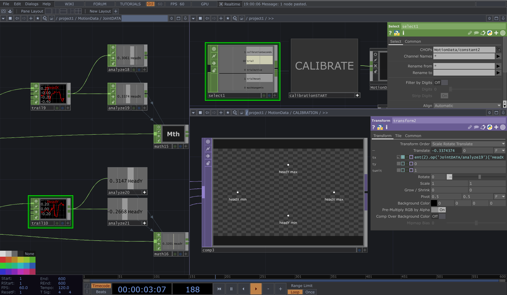

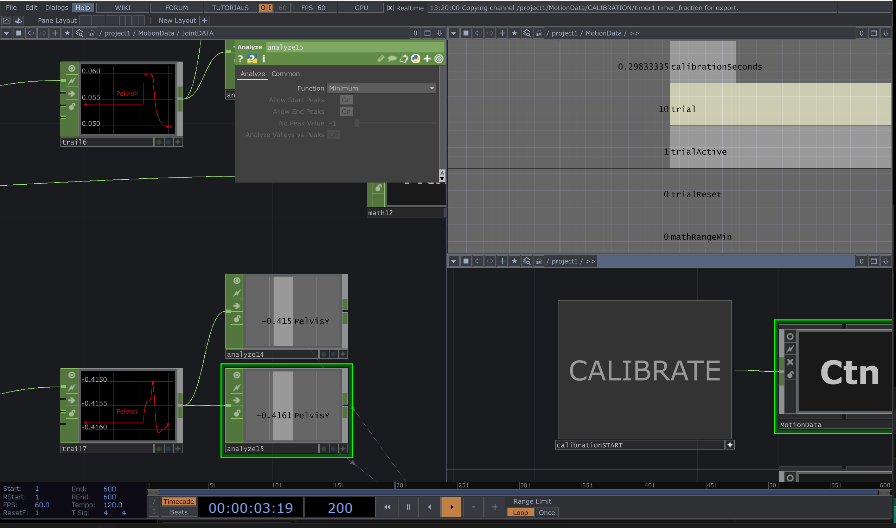

**Steps**
- building a calibration system with dynamic values and visualization
- creating a skeleton visualization in TouchDesigner
- testing timer-based min/max calibration

**Problems**

1. **Limited flexibility**
   - Calibration was initially only prepared for specific joints.
   - If other joints were to be calibrated, they had to be adjusted manually.

2. **Confusing visualization**
   - The calibration view itself became visually confusing.
   - Normalizing it back to a readable aspect ratio was difficult.

3. **Calibration as additional complexity**
   - Instead of simplifying the setup, calibration added another technical layer.
   - It became clear that a technically possible solution is not always a performatively useful one.

**Solutions**
- using dynamic channel names with Python
- building more flexible CHOP structures

**Learnings**
- understanding ways of data normalization with Trail and Analyze CHOPs in TouchDesigner
- building dynamic CHOP node setups with Python references
- realizing again that motion data has to be prepared very carefully

---

### 2.3 Second Test – 04.03. with Riccardo in the Theater Hall

In the context of the acting movement project, we were able to rent the theater hall for further tests.

**Goal:** *Test the refined technical setup with Kinect V2, sound material, and calibration.*

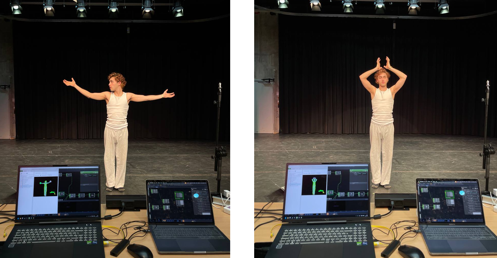

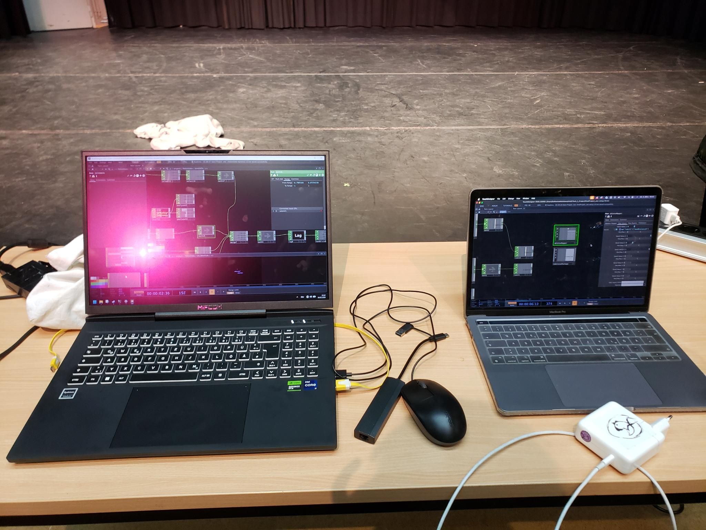

**Steps**
- testing the calibration
- testing and experimenting with sounds and parameters
- receiving direct feedback from Riccardo as performer

**Problems**

1. **Calibration did not solve the core issue**
   - If the performer moved away from the camera, body height was still measured in relation to camera perspective.
   - The system still depended too much on spatial position.

2. **Constant recalibration created confusion**
   - The calibration had to be updated constantly.
   - This made the relationship between movement and sound dependent on previous movements, which was confusing.

3. **Axis-based calculations remained unstable**
   - Values based on separate x, y, z coordinates caused problems when the performer moved or rotated between axes.
   - The interaction did not feel stable enough.

4. **Sound design was still too dense**
   - Some sound layers were too complex or too active on their own.
   - This made the body–sound relationship harder to perceive.

**Learnings**
- use **relative data** instead of absolute data
- work with simple and clear relations between body parts and sound
- use clearer sounds and reduced sound layers
- latency is significant for the authenticity and traceability of the relationship between sound and movement for both performer and audience

---

### 2.4 Data Refinements and Concept Changes

**Goal:** *Integrate the learnings and Riccardo's feedback into both the technical and conceptual aspects of the project.*

#### Concept Changes

This phase marked an important conceptual shift:

- new focus: **Body – Movement – Relation** instead of **Body – Space Relation**
- the relationship between performer and space should arise through the interaction of the performer with their own body, not mainly through absolute position in the room

This made the setup more performative and conceptually more coherent.

#### Clear Parameters

Riccardo and I talked about which parameters felt interesting to explore on stage. It became clear that it works best to have specific assignments to body parts, instead of stacking too many sound layers on top of each other.

At this point I reduced the setup to a smaller number of central mappings:

1. volume / low-pass filter: body height
2. hand–head distance: volume + speed / interval
3. trigger: samples played when holding above a threshold over time
4. speed of body

#### Euclidean Distance

**Goal:** *Calculate distance values between joints as direct spatial distances, independent of separate x, y, z axes.*

Research: [Euclidean distance](https://de.wikipedia.org/wiki/Euklidischer_Abstand)

Free Source TouchDesigner Container: [Distance Calculator](https://github.com/gwangyu-lee/TouchDesigner-Distance-Calculator)

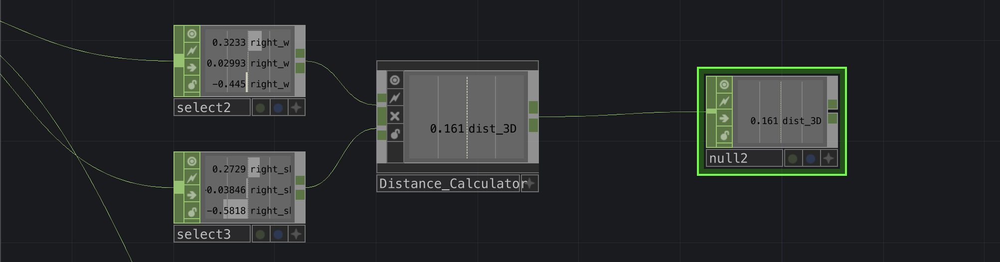

Using Euclidean distance became important because it allowed me to work with values that describe actual relations between joints, instead of relying on unstable axis-based calculations.

#### Second Approach: Relative Data

**Goal:** *Rebuild the system based on relative joint relations.*

At this point I came to the conclusion:

- calibration = chaos
- absolute data is not controllable, because it depends too much on camera perspective and the distance between sensor and body
- relative data places the performer more clearly at the center of the performance
- concrete assignments to specific body parts such as hand or head were much more interesting to explore on stage

This included values such as:
- head–hand distance
- hand–hand distance
- body speed
- relation to the body center

> This step was one of the most important decisions in the whole project, because it fundamentally improved both reliability and performability.

---

### 2.5 Third Test – 06.03. with Riccardo in the Theater Hall

**Goal:** *Test the technical changes based on relative motion data and newly implemented sound ideas.*

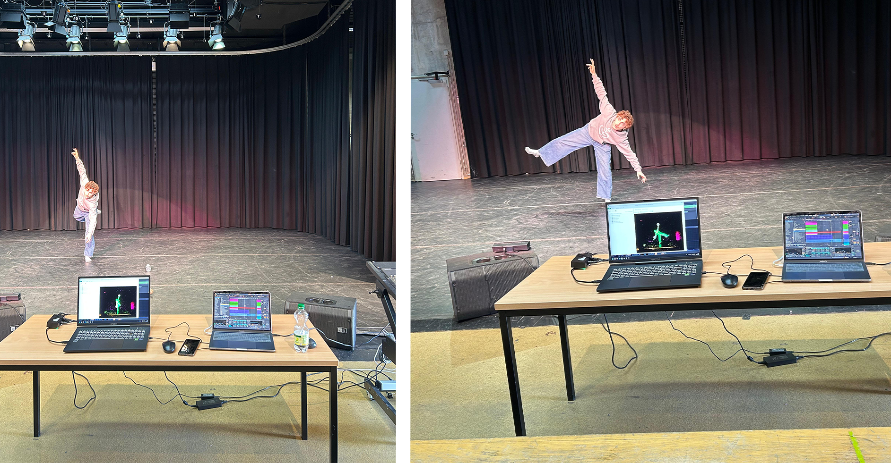

**Steps**
- confirming that relative data is much more reliable
- collecting positive feedback from Riccardo
- generating new ideas and inspirations for gestures and sounds

**Problems**

1. **Tempo mapping remained difficult**
   - It was not clear whether the tempo of a sample could be mapped in a musically meaningful way through motion.
   - Some approaches felt forced or too unstable.

2. **MIDI mapping questions remained open**
   - I still needed to clarify how to best trigger or shape events via MIDI.

**Learnings**
- testing is better than assuming
- use filter mappings for frequency changes instead of direct pitch mappings
- relative data clearly improved the interaction quality

#### TDAbleton Research

During this phase, I familiarized myself more deeply with the various components of the TDAbleton package in TouchDesigner.

[TDAbleton Documentation](https://docs.derivative.ca/TDAbleton)

Relevant categories of parameters at this point were:
- velocity of a joint
- acceleration / impulse / sudden movement
- distance to body center
- verticality (y-position)
- area / expansion (distance between hands)

**Open technical question**

In Ableton, directly changing global tempo in a musically useful way was not possible within my setup.

Possible workarounds I considered:
- plugin-based solution
- Max for Live
- building a synthetic heartbeat instead of controlling the master tempo directly

 
 

## 3. Final System Development

### 3.1 Dynamic Workflow and Built Pipeline

In the final phase of the project, I was able to work on the overall musical composition using the pipeline I had built and the Kinect recordings from the tests. At this point, I finally had a setup that enabled a dynamic and experimental workflow for refining the idea. This was the phase in which the project started to feel like a coherent system rather than a collection of separate experiments.

The pipeline consisted of:
- Kinect recordings of Riccardo from the test runs
- selected value calculations in TouchDesigner
- data flow to Ableton
- various tracks, samples, and sound layers in Ableton

#### Organizing File Structures

At this stage, organizing project files and separating test setups from more stable system versions also became important, because the technical process had become increasingly complex.

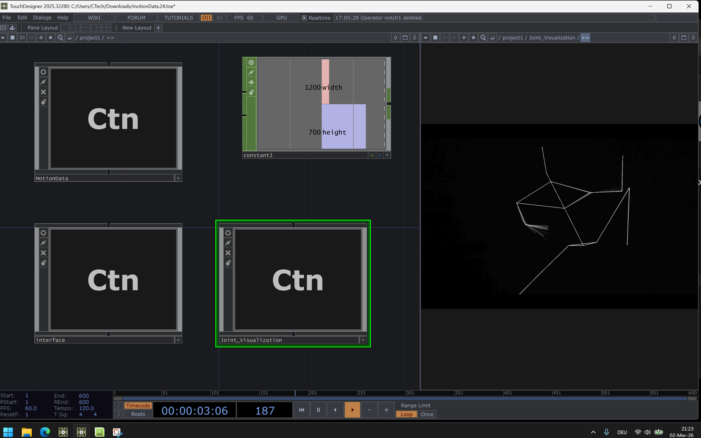

#### Sound Refinements & Decisions

A central question during this phase was: *How do the sound layers really work together when they are continuously shifting through tracking?*

This led me again to the decision to reduce and simplify:
- fewer layers
- clearer relations
- stronger readability for performer and audience

#### Binaural Tracks

I also considered the use of binaural or spatial sound ideas in order to strengthen the bodily and immersive quality of the setup. This part remained more experimental and was not developed as far as other aspects of the system.

---

### 3.2 Sound Design – Reorientation & Reduction

**Goal:** *Create a clearer relation between body movement and sound by reducing layer complexity while exploring spatial sound approaches to express internal bodily states.*

**Feedback from Riccardo:**
- clearer sounds
- more concrete assignments
- less oscillation

**→ Main problem:** clear assignment. It was often not readable enough which movement caused which changes, because:

- too many layers at once
- too much internal movement already inside the sounds (oscillation, modulation, animated textures)
- tracking changed several parameters continuously
- relation between **movement** and **sound** became unclear

*→ How can I map motion parameters to sound in a way that keeps the interaction readable and perceptible for performer and audience?*

#### New Sound Arrangement

I reorganized the system into more clearly separated sound functions:

| Layer | Bodily Dimension | Sonic Role |
|---|---|---|
| **Ground Layer** | grounding / vertical presence | sonic foundation |
| **Atmosphere Layer** | openness / spatial expansion | harmonic environment |
| **Inner Body Layer** | internal bodily processes | intimate internal sounds |
| **Event Layer** | energetic gestures | triggered sound events |

**→ Ground Layer** · *grounding, physical stability*
- low-frequency drone
- forms the **sonic foundation** of the system
- creates a sense of **weight and stability**
- represents the body's **relation to gravity**
- slow, continuous layer rather than reactive gesture sounds

**→ Atmosphere Layer** · *openness, spatial expansion*
- harmonic / tonal textures
- creates the **surrounding sound environment**
- introduces **width and spatial depth**
- in-/decreasing panning

**→ Inner Body Layer** · *internal bodily processes*
- intimate sound elements
- **breathing, pulse, internal movement**
- quieter layer compared to the outer sound layers
- highlights subtle bodily states and inner attention

**→ Event Layer** · *expressive gestures, sudden movement*
- short, discrete sound events
- appear momentarily within the soundscape
- **contrast to the continuous layers**
- emphasize **energetic or expressive gestures**
- sonic accents

| Before | → | After |
|---|---|---|
| many overlapping layers | → | fewer layers |
| blurred interaction | → | clearer mapping |
| motion-to-sound relation too dense | → | clearer distinction between continuous layers and triggered events |
| internal movement inside sound tracks | → | reduced oscillation and modulation |

**Steps**
- reduced the number of sound layers
- clarified the roles of the remaining layers
- reorganized system structure
- explored ideas from the workflow (e.g. binaural sound, spatial panning)

**Problems**
- balancing **reduction** and **artistic expression**
- keeping the system clear while experimenting with new ideas
- avoiding too much internal movement inside the sounds

**Learnings**
- clear layer roles improve the readability of the interaction
- reduction can make the interaction more expressive
- structural clarity is as important as sound design

---

### 3.3 Parameter Extensions & Python Scripts

During the refinement workflow, I got additional ideas for more concrete and conditional parameter calculations, for example:
- closed arms over the body
- closed arms in front of the chest
- arm speed → triggers sample

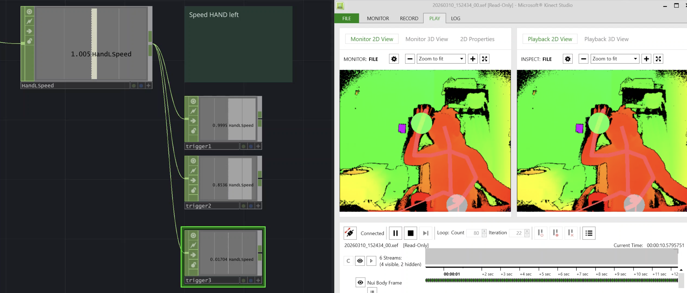

These ideas later fed into the gesture detection system.

**Problems**

1. **Complexity management**
   - As the system became more complete, file organization and clarity became more important.
   - Without structure, it was easy to lose overview again.

2. **Balancing sound layers**
   - Even in the final phase, the challenge remained to keep the sound expressive without becoming too dense.

**Learnings**
- working with CHOP Execute DAT
- writing simple Python scripts
- a stable pipeline enables artistic refinement
- reduction is not a limitation, but a design decision
- technical organization is part of the creative workflow

---

### 3.4 MIDI Trigger Connection (10.03.)

**Goal:** *Trigger sounds in Ableton directly from motion-based values in TouchDesigner.*

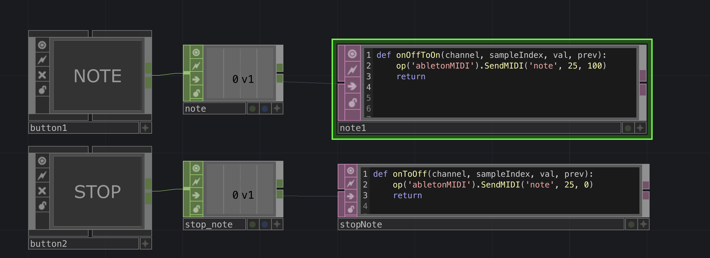

**Steps**
- connecting TouchDesigner to Ableton Live via MIDI / OSC using **TDAbleton**
- using trigger channels to activate a **CHOP Execute DAT**
- implementing Python scripts to send MIDI notes: `SendMIDI('note', note, velocity)`
- testing triggers for **start**, **stop**, and **stop all** sound events in Ableton

**Problems**

1. **Python syntax errors**
   - Small mistakes such as `po()` instead of `op()` prevented the triggers from working.
   - This was especially frustrating because the setup looked correct on a structural level.

2. **Callback confusion**
   - It was initially unclear which CHOP Execute DAT callbacks were needed (`onOffToOn`, `onOnToOff`).
   - This made debugging slower.

3. **Abrupt sound endings**
   - Triggered sounds stopped too suddenly when the trigger ended.
   - The result felt technically harsh and musically unconvincing.

**Learnings**
- TouchDesigner triggers can reliably control external audio via MIDI
- CHOP Execute DAT callbacks translate data events into scripted actions
- proper envelope / release settings in Ableton help avoid abrupt sound endings
- debugging Python scripts carefully is essential for real-time interactivity

---

### 3.5 Gesture Detection Setup

**Goal:** *Extract concrete gesture states from body tracking data and forward them as trigger signals for sound or visual processes.*

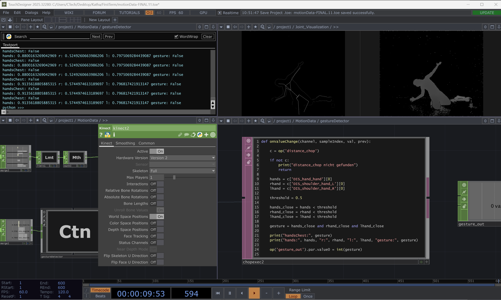

Implemented gestures included hands on chest, hands above head and crouch / low torso *(see Gesture Detection at Project Presentation)*

**Steps**
- importing and organizing body-tracking channels in a CHOP network
- creating a **CHOP Execute DAT** to access channel values with Python
- reading key parameters:
  - hand-to-hand distance
  - hand-to-head distance
  - hand-to-chest distance
  - torso height
  - hand positions relative to head
  - shoulder rotation
  - pelvis shift
  - overall body velocity
- defining thresholds for different gestures
- implementing gesture conditions in Python
- converting gestures into binary outputs and forwarding them to **gesture_out CHOP**

**Problems**

1. **Technical fragility**
   - Python callbacks only triggered with the correct input CHOP and settings.
   - Errors occurred if a referenced CHOP was not found.

2. **Strict naming dependencies**
   - Channel names had to exactly match the tracking data.
   - Small mismatches caused the whole logic to fail.

3. **Threshold instability**
   - Continuous values fluctuated strongly.
   - Sometimes Kinect lost track of joints.
   - Gesture recognition flickered if the thresholds were too sensitive.

**Learnings**
- relative body relations are more reliable than absolute coordinates
- separating gestures into a dedicated CHOP simplifies reuse in the system
- debugging requires careful checking of node paths, channel names, and CHOP Execute triggers
- combining distance, height, and velocity improves gesture robustness
- threshold tuning is critical to avoid flickering states

---

### 3.6 Stillness Detection (14.03.)

**Goal:** *Detect moments of stillness based on body velocity and convert them into stable gesture triggers.*

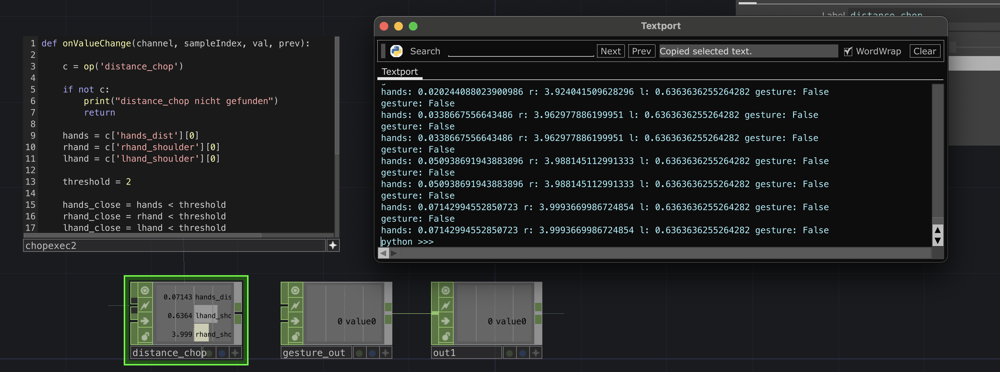

**Steps**
- using the `SPEED_body` channel from the tracking data as an overall movement measure
- smoothing the velocity with a **Filter CHOP**
- applying a **Logic CHOP** with a velocity threshold (`< 0.2`) to detect stillness
- using a **Count CHOP** to ensure a minimum duration of approximately 30 frames for intentional stillness
- outputting the result as the binary signal `gesture_still`

**Problems**

1. **Noise in low-movement states**
   - Stillness is technically difficult because even very small fluctuations remain in the data.
   - Without smoothing, false detections occurred easily.

2. **Need for temporal stability**
   - A single threshold was not enough.
   - The system needed a minimum duration so that stillness would be recognized as intentional.

**Learnings**
- stillness is not simply the absence of movement; it has to be technically stabilized
- smoothing and duration thresholds are necessary to distinguish intentional stillness from noise
- subtle gestures often require more care than larger movements

 
 

## 4. Key Development Insights

Over the course of the process, several central insights became clear:

1. **Relative data works better than absolute data.**
   Absolute coordinates depended too strongly on camera perspective, room setup, and performer position. Relative relations between body parts were much more stable and intuitive.

2. **Reduction improves clarity.**
   Too many mappings and too many sound layers made the interaction harder to understand. A smaller number of clearly defined relations worked better artistically and technically.

3. **Testing with performers is essential.**
   Important decisions only became obvious through practical testing, especially through feedback from Riccardo.

4. **Technical stability shapes artistic quality.**
   Problems such as clipping, latency, unstable values, or threshold flickering were not only technical issues; they directly affected the performative quality of the system.

5. **The final system emerged through rethinking, not just refining.**
   One of the most important shifts in the project was not a small technical fix, but the decision to move from calibration and absolute data toward a system based on relative body relations.

   

# Project Categorization

## Creative / Artistic Development

A central part of my result is the creative and artistic development of a body-driven sound instrument. The project developed from a rather open conceptual idea about dramaturgy, emotional states, and bodily presence into a performative system in which movement, posture, and gesture continuously shape a layered sound environment.

An important artistic development was the shift from thinking about the body mainly in relation to space toward thinking about the body in relation to itself. This changed the aesthetic direction of the work and helped me create a more embodied and performative interaction.

## Narrative Development

The project does not follow a classical linear narrative but narration emerges through conditions, states, and transformations. The narrative development took place through the idea of a dramaturgical landscape. The finalmcreates a setting in which different emotional or physical states can be explored rather than narrated explicitly.

## Audio-Visual Design

The main focus of the project was audio design, but visual design also played a role in the process, especially through:

- data visualizations in TouchDesigner
- skeleton tracking views
- interface structures for understanding and debugging motion parameters

On the audio side, I developed a layered sound environment consisting of drones, rhythmic elements, breathing-like textures, and triggered samples. A key design decision was to reduce the complexity of the sound layers in order to make the body–sound relationship more legible.

## Software Development

Not direct software development, but in the sense that I had to communicate across different software systems in a very interdisciplinary way.

I worked with:
- TouchDesigner
- Ableton Live
- TDAbleton
- Python inside TouchDesigner
- OSC / MIDI communication

This included:
- setting up motion tracking pipelines
- selecting and processing joint data
- building gesture detection systems
- sending continuous and trigger-based values to Ableton
- scripting Python logic for condition-based gesture outputs

## Hardware and Pipeline Development

The project also involved hardware and pipeline development. The hardware setup strongly influenced the project, especially in relation to CPU overload, tracking reliability, and latency. Building a stable pipeline became one of the most important technical tasks.

I worked with:
- laptop camera during early exploration
- Kinect V2 as the main tracking sensor
- two-laptop setup for separating TouchDesigner and Ableton
- OSC / MIDI communication between systems

## Algorithms

Algorithmic aspects of the project included:

- motion parameter calculations
- threshold-based gesture recognition

## Research / Experimentation

Research and experimentation were core to the entire process. The project developed iteratively through cycles of testing, failure, revision, and refinement.

The process included:
- researching motion tracking tools (PoseNet, Kinect V2)
- researching calibration and normalization methods
- experimenting with mappings between movement and sound
- testing the system with performers
- integrating feedback from tests into technical redesigns

# Reflection 

## Reflection of technical choices

*The three most important decisions I made during my process:*
 

1. **technical setup components**

    The decision regarding the technical components of my setup stemmed, on the one hand, from my interest in Ableton Live, my existing familiarity with TouchDesigner, and the accessibility of the Kinect V2. Even though the setup still has room for improvement in terms of reliability, it served its purpose of allowing me to explore the interplay between sound and physical movement within a realistically feasible framework.

2. **shifting my focus to relative motion data**
3. **streamlining my sound concept**

    The shift to relative data and the simplification of the sound concept resulted particularly from my collaboration with Riccardo as he tested the setup on stage. His feedback helped me develop a sense of which parameters were truly crucial, interesting, and effective.
    In particular, my sound concept was initially too expansive and initially hindered me from developing a precise sense of it, which was necessary to establish a comprehensible relationship between body and sound. 
    Instead of becoming too deeply entangled in a concept, next time I would view the process more as an integrative and open-ended one.

  

## Reflection on your Minimal viable product and Best-case scenario plans
*What did you archive, what not and why?*

In my projectplan I suggested this as a best case scenario:

* to develope not only linear input - output relation
* spatial sound environment with dramaturgical structures
* dramaturgy concept for the *sound - space - time* relations, not linear but conditional
(-> possible parameters: proximity and distance, speed and stillness, presence over time)

 
and this as a minimal viable product:

* to develop a functioning technical setup
* to develop a workflow between motion data and soundparameter: How do I interpret the data so that it coherently supports and expresses my emotional sound concept?
* to develop a sound concept as a creative research: at least three soundscapes that are associated with corresponding emotions, movements, and/or states and convey these as different moods/feelings

 

At the end of this project, I have to say that I am closer to the minimal version than to the best-case scenario. 
I have created a functioning technical setup with five different parameters and developed a functioning workflow between tracking, data processing, and sound over the course of the project. It took a lot of time to develop a feel for handling the data, its interpretation, normalization, and control. The focus therefore shifted to these technical components during the process, while the artistic part tended to be reduced.

What I did not manage to achieve within the time frame was a conditional dramaturgy and a comprehensive sound concept with regard to my concept of conveying different emotions. 
 
However, in the course of the process, I increasingly noticed two things: 
 
1. The processing of movement data is complex and requires a broader examination than I had initially estimated
2. A spatial soundscape is not really necessary for the intention of my project, as the legibility of the movement-sound relationship on stage works very well when the sound scene is minimal

Even though I was frustrated at times about seemingly “not achieving” my goals, looking back on the process now, I realize that I learned a great deal. In addition, working with Riccardo in particular brought inspiration and flexibility to the concept. The experience of this collaboration opened my eyes to how my work can develop collaboratively and what is really interesting from the perspective of the person on stage.

## Challenge of your comfort zone
*What was new for you, and what did you learn?*
*What was the most difficult for you?*

Following on from that, it was also what took me out of my comfort zone. Interacting with other students, even though I didn't feel confident about my work yet.
Both components—sound and motion tracking—were new to me (at least in this dimension) and sometimes challenged me greatly to achieve the quality I was striving for.

I learned:
* Understanding of motion data processing
* How to use and control the data
* Real-time interaction between Ableton Live and Touchdesigner (amazing potential!)
* Working with actors
* Further steps in sound production*  Working with OSC connections

This challenged me:
Data control:
* Gaining control over motion data

Sound production: 
* Producing tracks that truly captured my idea of the different emotional stages (a lot of frustration)
* Not losing myself in the potential of sound production
* Testing my setup with other students, even though it wasn't final yet

## Reflection original work plan with timeline 
*To you follow your plan and if not, why not?*

As already mentioned, my focus shifted from the artistic concept to the technical aspects during the process. Through user testing with the actors, I realized that handling motion data requires much more attention than I had planned for.
Unfortunately, my planning was also generally unrealistic in terms of time with regard to other projects.

